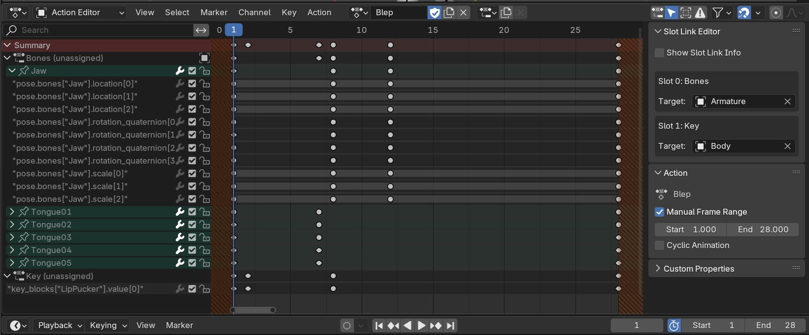

= Blender Slot Link
:homepage: https://github.com/emperorofmars/blender_slot_link
:hardbreaks-option:
:library: Asciidoctor
:table-caption!:
ifdef::env-github[]
:tip-caption: :bulb:
:note-caption: :information_source:
endif::[]

Preserve what Actions and Slots are animating.

Re-apply an Action anytime by pressing `Link`.
Prepare the Scene for animating a new Action by pressing `Prepare`.

No need to re-link the Actions and Slots manually and having to remember where.

Writing an exporter for animations in Blender 4.4+ should become possible and fairly straight forward if this extension is used. I am working on a highly experimental one here: https://github.com/emperorofmars/stf_blender

This allows targeting only objects on purpose, for now.
TODO: allow a select few other types, like collections and scenes.

This brings Blender closer to how the rest of the world works. That way, you can animate the shape-keys of a specific instance of a mesh, instead of the mesh resource itself. While this won't replay 100% correctly in Blender, it will in the game-engine you export this to, if that ever becomes possible.

== License
All source-code in this repository, except when noted in individual files and/or directories, is licensed under either:

* MIT License (LICENSE-MIT or http://opensource.org/licenses/MIT[])
* Apache License, Version 2.0 (LICENSE-APACHE2 or http://www.apache.org/licenses/LICENSE-2.0[])
* GNU General Public License v3.0 or later (LICENSE-GPL3+ or https://www.gnu.org/licenses/gpl-2.0-standalone.html[])

// Command to build the extension with a default Windows Blender installation:
// Change the Blender version in the path accordingly.
// C:\'Program Files'\'Blender Foundation'\'Blender 4.4'\blender.exe --command extension build
