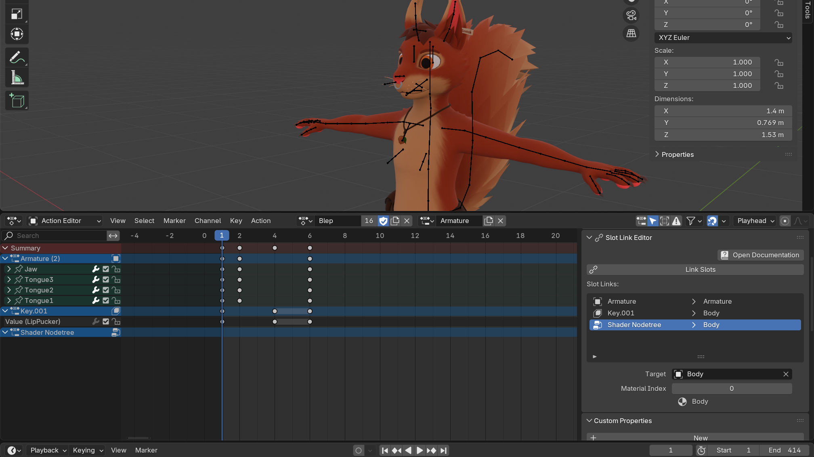

# Blender Slot Link
**Specify what Actions and Slots are animating!**

Slot Link helps you manage Blender projects with multiple separate animations.
It automates the unlinking & linking of Actions and Slots, without requiring you to remember which goes where.

Re-apply an Action anytime by pressing `Link Slots`.

*Requires Blender 4.4 or higher. Not compatible with legacy Actions.*

🌰 **[Installation](https://extensions.blender.org/add-ons/slot-link/)** 🌰 **[User Guide](https://docs.stfform.at/guide/blender/slot_link.html)** 🌰



## License
All source-code in this repository, except when noted in individual files and/or directories, is licensed under either:

* MIT License (LICENSE-MIT or <http://opensource.org/licenses/MIT>)
* Apache License, Version 2.0 (LICENSE-APACHE2 or <http://www.apache.org/licenses/LICENSE-2.0>)
* GNU General Public License v3.0 or later (LICENSE-GPL3+ or <https://www.gnu.org/licenses/gpl-2.0-standalone.html>)

<!--
**Commands to build the extension.**\
*Change the Blender version in the path accordingly.*

* Windows Git Bash
	* Build Extension
		```sh
		C:\\'Program Files'\\'Blender Foundation'\\'Blender 4.5'\\blender.exe --command extension build
		```
-->
