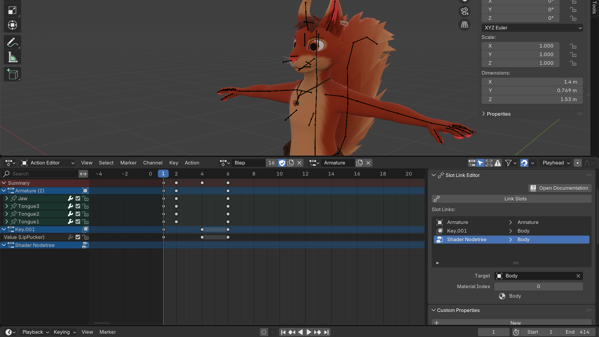

# Blender Slot Link
**Slot Link helps you manage Blender projects with multiple separate animations.**

It automates the unlinking & linking of Actions and Slots, without requiring you to remember which goes where.

Re-apply an Action anytime by pressing `Link Slots`.

*Requires Blender 4.5 or higher. Not compatible with legacy Actions.*

🌰 **[Installation](https://extensions.blender.org/add-ons/slot-link/)** 🌰 **[User Guide](https://docs.stfform.at/guide/blender/slot_link.html)** 🌰 **[Report Issues](https://codeberg.org/emperorofmars/blender_slot_link/issues)**



Please open issues for any bugs or misbehavior you notice. Feel free to open issues for feature requests.

## Development Setup
* Have an up to date version of Blender installed.
* Either:
	* Use `bpydev.py` included in this repository.
	* Use VSCode with the [recommended extensions](./.vscode/extensions.json).\
		The most important one is [Blender VS Code](https://github.com/JacquesLucke/blender_vscode).
* Create a Python 3.13 venv in the repo directory.
* Inside the venv run:
	``` sh
	pip install -r requirements.txt
	```

## Contributing
Human made contributions via pull-requests are very welcome.

See [CONTRIBUTING.md](./CONTRIBUTING.md) for guidelines and development environment setup.

## License
All source-code in this repository, except when noted in individual files and/or directories, is licensed under either:

* MIT License (LICENSE-MIT or <http://opensource.org/licenses/MIT>)
* Apache License, Version 2.0 (LICENSE-APACHE2 or <http://www.apache.org/licenses/LICENSE-2.0>)
* GNU General Public License v3.0 or later (LICENSE-GPL3+ or <https://www.gnu.org/licenses/gpl-2.0-standalone.html>)


<!--
**Commands to build the extension.**\
*Change the Blender version and path accordingly.*

* Set Blender Path Variable
	* Windows (Git Bash)
		``` sh
		BLENDER_PATH="C:\Program Files\Blender Foundation\Blender 4.5\blender.exe"
		```
	* Linux Bash
		``` sh
		BLENDER_PATH=~/Software/blender/blender-5.0.1-linux-x64/blender
		```
	* Linux Fish
		``` sh
		set BLENDER_PATH ~/Software/blender/blender-5.0.1-linux-x64/blender
		```
* Build Extension
	```sh
	$BLENDER_PATH --command extension build --output-dir=./packages
	```
-->
