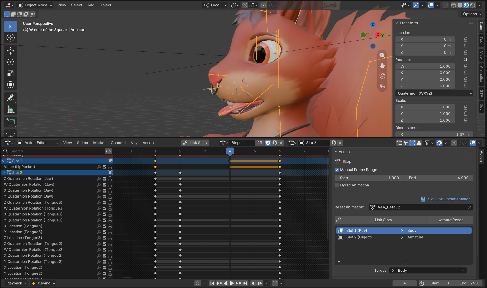

# Blender Slot Link
**Slot Link helps you manage Blender projects with multiple separate animations.**

Blender supports only one animation per .blend file.\
Actions are modular pieces from which the one animation is composed of.

**Slot Link redefines Actions to be full standalone animations.**\
To achieve that, you have to set the animation targets for each Action-Slot.

Press the `Link Slots` button to play and edit an animation.\
Easily switch between animations with only one additional button press.

*Requires Blender 4.5 or higher. Not compatible with legacy Actions.*

🌰 **[Installation](https://extensions.blender.org/add-ons/slot-link/)** 🌰 **[User Guide](https://docs.stfform.at/guide/blender/slot_link.html)** 🌰 **[Report Issues](https://codeberg.org/emperorofmars/blender_slot_link/issues)**



> [!NOTE]
> Slot Link purposely allows only selecting Objects as targets.
>
> If you animate a meshes shape keys, simply select the object on which that mesh is instantiated.
>
> This brings the data-model closer to how game engines and other tools work, but it may not always replay correctly in Blender.
>
> In case you animate the shape keys of a mesh-instance, Blender will play the animation on all instances of that mesh.\
> Animating two instances of the same mesh differently is impossible.\
> This is unfixable with extensions and has to be addressed in Blender natively.
>
> The Slot Link data-model however is ready for export into game-engines, where it will correctly target only the specified instance of the mesh.\
> The only importer/exporter capable of using SlotLink animations right now is the experimental [STF format](https://docs.stfform.at).

Please open issues for any bugs or misbehavior you notice. Feel free to open issues for feature requests.

## Development Setup
* Have an up to date version of Blender installed.
* Either:
	* Use `bpydev.py` included in this repository.\
		Run `python bpydev.py -h` for more info.
	* Use VSCode with the [recommended extensions](./.vscode/extensions.json).\
		The most important one is [Blender VS Code](https://github.com/JacquesLucke/blender_vscode).
* Create a Python 3.14 venv in the repo directory.
* Inside the venv run:
	``` sh
	pip install -r requirements.txt
	```

## Contributing
Human made contributions via pull-requests are very welcome.

See [CONTRIBUTING.md](./CONTRIBUTING.md) for guidelines.

### Features to Consider in the Future
* Operator to layout all Slot-Linked Actions into the NLA, so they can all be exported into FBX, without hassle. (And perhaps an operator to do the inverse.)
* The ability to retarget animations from one target collection to another, deterministically.\
	This will require artists to set matching `retargeting_id`s on objects of different collections. Build GUI to help and validation to help with that.

## License
All source-code in this repository, except when noted in individual files and/or directories, is licensed under either:

* MIT License (LICENSE-MIT or <http://opensource.org/licenses/MIT>)
* Apache License, Version 2.0 (LICENSE-APACHE2 or <http://www.apache.org/licenses/LICENSE-2.0>)
* GNU General Public License v3.0 or later (LICENSE-GPL3+ or <https://www.gnu.org/licenses/gpl-2.0-standalone.html>)


<!--
**Build the extension**

Install dependencies (preferably into a venv):
``` sh
pip install -r requirements.txt
```

Build the extension:
``` python
python bpydev.py package -o packages
```
-->
